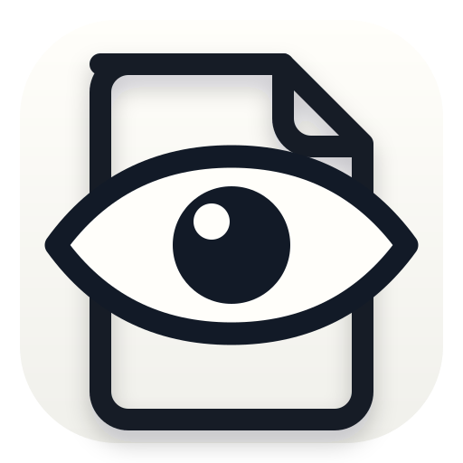

# Glance

<p align="center">
  
</p>

A macOS-Preview-style PDF and image viewer built for Omarchy.

One file, one window, one process — no gallery, no recents, no shared state.

## Design

- **Qt 6.11 / QML** — same rendering stack as the Omarchy shell
- **Vendored MuPDF 1.28.3** (static) — PDF + images in a single engine
- **Omarchy theme integration** — reads `colors.toml` from the active theme,
  hot-reloads on `omarchy theme set`
- **Zoom buckets** — textures render at quantized 1.25 steps; zoom stays
  fluid between buckets, snapping sharp when the higher-res texture lands
- **Automatic OCR** — visible scanned pages and images are recognized in
  isolated, low-priority processes so reading, scrolling, and zooming stay
  responsive

## Build

```sh
git clone --recursive https://github.com/ramselvaraj/glance.git
cd glance
./scripts/build.sh
./build/glance file.pdf
```

Arch build dependencies: `base-devel cmake ninja qt6-base qt6-declarative`.
Runtime OCR dependencies: `poppler tesseract tesseract-data-eng`. OCR currently
uses English language data.

## Install

Install for the current user and register Glance as the default PDF/image
viewer:

```sh
./scripts/install-user.sh --set-defaults
```

The binary is copied to `~/.local/lib/glance/glance`, so the installed app does
not depend on the repository or build directory remaining in place. Re-run the
same command after updating Glance. To remove the installed files:

```sh
./scripts/uninstall-user.sh
```

## Keys

| Key | Action |
|-----|--------|
| j/k | next/prev page |
| d/u | half page down/up |
| g/G | first/last page |
| +/− | zoom |
| w/p/1 | fit width / fit page / 100% |
| r | rotate 90° |
| t | thumbnails |
| f / F11 | fullscreen |
| o | open file |
| Ctrl+Shift+o | recognize text on the current scanned page/image |
| Ctrl+c | copy selected text, or the current page when nothing is selected |
| q | quit |

Touchpad: two-finger scroll = kinetically scrolled viewport; two-finger pinch =
zoom around gesture center; Ctrl+wheel also zooms.

Pointer behavior: drag selects native or recognized text; Space+drag pans;
image-only regions pan directly. Double-click selects a word and triple-click
selects a line.

OCR starts automatically for visible scanned pages and images, then processes
nearby pages while idle. Recognition can be cancelled or retried from the
`ocr` toolbar button. Completed pages are immediately selectable and searchable
and are cached across launches.

## License

AGPL-3.0-or-later (see LICENSE). MuPDF is vendored (AGPL) — see
`third_party/mupdf/`.
